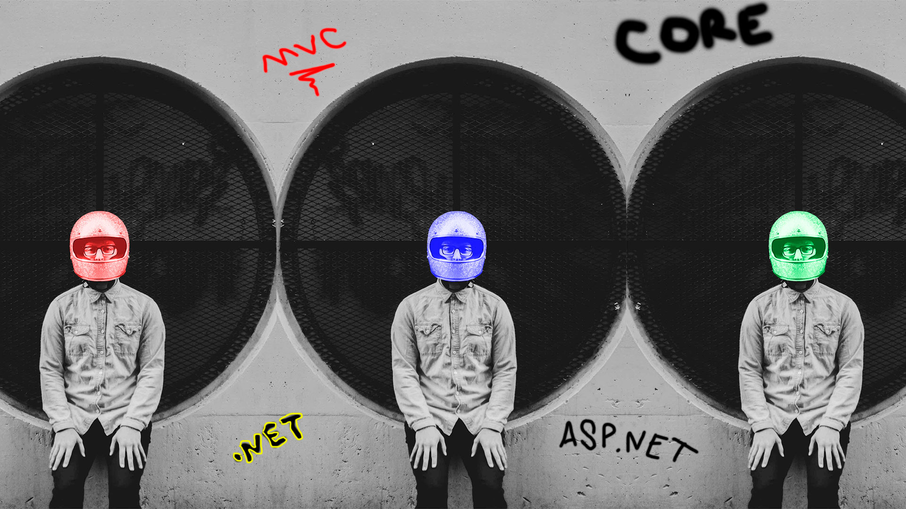

# Formação .NET - Caelum 
<!---->

<!-- Traduzir -->

<!-- Banner -->

  

<!-- Primeiros badges -->

  <!-- Codacy -->
  
  <!-- Último commit -->
  
  <!-- Tamanho do repo -->
  

<!-- Segundos badges -->

  <!-- Contibuidores -->
  
  <!-- Linguagens -->
  
  <!-- Licença -->
  

## Projetos
*   [Hello World]()

## Anotações
*   [Notion](https://www.notion.so/Forma-o-NET-e103bdd244524f019c853d4759f0d298)

## Licença 
*   [MIT](./LICENSE) &copy; Mir Carvalho